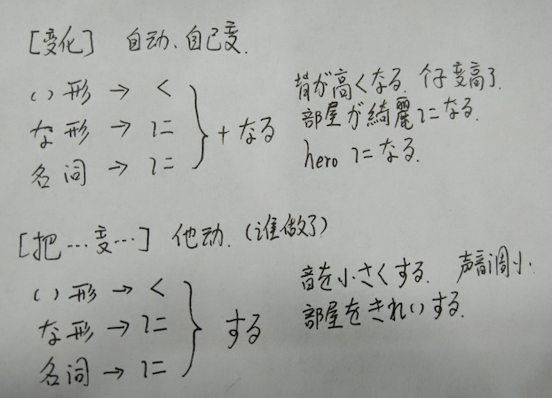
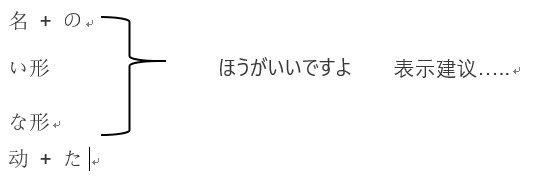

# 第五课
## 时间前后
| 前2单位 | 前1单位 | 现在 | 后1单位 | 后2单位 |　每 |
| ------ | ------ | ------ | ------ | ------ | ----- |
| 一昨日(おととい) | 昨日(きのう) | 今日(きょう) |　明日(あした) | 明後日(あさって) | 毎日(まいにち) | 
| 先々週(せんせんしゅう) | 先週(せんしゅう) | 今週(こんしゅう) |　来週(らいしゅう) | 再来週(さらいしゅう) |毎週(まいしゅう) |
| 先々月(せんせんげつ) | 先月(せんげつ) | 今月(こんげつ) |　来月(らいげつ) | 再来月(さらいげつ) |毎月(まいつき) |
| 一昨年(おととし) | 去年(きょねん) | 今年(ことし) |　来年(らいねん) | 再来年(さらいねん) |毎年(まいとし) |

> あす也表示 \[明天]，但是，更文艺.

| 早 | 中 | 晚|
| ------ | ------ | ------ |
| 今朝(けさ) | 今日 | 今晩(こんばん) |
 

| 星期一 | 星期二 | 星期三 | 星期四 | 星期五 |　星期六 | 星期日 |
| ------ | ------ | ------ | ------ | ------ | ----- | ----- |
| 月曜日(げつ) | 火曜日(か) | 水曜日(すい) | 木曜日(もく) | 金曜日(きん) | 土曜日(ど) | 日曜日(にち) |

## 单词
* 試験(しけん)　n　　考试
* 出張（しゅっちょう）n　出差
* お宅（おたく） 〔名〕 府上，（您）家
* ひきこもり　　　家里蹲
* アパート 〔名〕 公寓
* パーティー 〔名〕 party 联欢会
* 一時頃(いちじごろ)　　1点左右

> 单词的形态 ≠  用法  
> 因为，一个形态会有多个用法，开始学的时候，不要死板的把形态和用法一一对应起来.

## 语法和句法部分
* 时间名词
    >①具体的时间名词 + に + 动词 
    >森さんは七時に起きます。森先生七点起床. 
    >②抽象的时间名词，(前年，去年，昨天，明天，. . .) 使用时不加に 
    >森さんは先週休みました。森先生上周休息了.

* ます形态
    > 原形 ==> ます形 (礼貌体，敬语) 
    >原形和ます形都表示 \[现在] 和 \[将来]

* いつ 后面一般接动词 
    >いつ寝ますか. 多久睡觉啊?

* いつも
    >いつも仅表示： 一直都是 ... 
    >いつもは表示，一直都是 ...(暗指这次不是或者其他意味，这里的は是加了对比)

# 第六课
## 单词
* 子供(こども)　　小孩子
    >子供の日　　儿童节(日本的儿童节在 5月5日, 挂鲤鱼旗)
* 汽車(きしゃ)　　火车(...)
* 飛行機（ひこうき） 〔名〕 飞机
* 友達（ともだち） 〔名〕 朋友
    >友達以上(いじょう)，恋人未満(こいびと　みまん)
* たしか　　好像是
    >昨日何時に寝ますか. 
    >たしか9時です。好像是9点.
* まっすぐ　　径直，笔直.
    >まっすぐ行きます。径直地走 
    >まっすぐな人　　正直的人.
* 花畑(はなばたけ)　　花田.

## 语法部分
* 地方 + へ (来，去，回) 移动的目的地
    >葉子先生のうちへ行きます。去叶子老师的家里.

* 在介绍时，一般会这么说.
    >私は___です，中国から来ました。我是___,来自中国.

* と  用法： 和 ~
    >A と B　　　　　A和B 
    >Aと+动词 　　和A去做~ 
    >唐三藏は猪八戒と西天へ行きます。 唐三藏和猪八戒去西天. 
    >私は友達と一緒に学校へ行きます。我和朋友一起去学校.

* 助词 で 的用法，表示乘坐交通工具.
    >自転車で学校へ行きます。骑自行车去学校. 
    >会社まで何でいきますか. 乘坐什么工具去的公司 ？ 
    >特别的： 如果是走路， 这么说: 
    >家から会社まで歩いて行きます。从家走路到公司.

* 駅へ何で行きますか  ===等价于=== 何で駅へ行きますか。
    >仅仅是语序不同而已.

* は的强调对比.
    >对比意义的强调。 （之前在 いつも和いつもは的区别中提到过)

# 第七课
## 单词
* 丼ぶり　　名词  大碗.
* 親子丼　　鸡蛋鸡肉盖浇饭.
    >衍生： 他人丼(たにんどん) 两种不同种的盖浇饭，比如， 鸡肉 + 猪肉 盖浇饭.
* リンゴ　(林檎)   苹果.
* イチゴ　　草莓.

## 语法部分
* じゃあ |　では   都表示 "那么"
    >用じゃあ的场合， 分开的时候，  那么, (明天见 _ 暗指) 
    >用では的场合，一般不单独用，     ではまた ， 那么下次再见.

* 助词 を 的用法.
    >を没有在任何单词中，只有助词的用法. 
    >被作用物体 を 动作.   动作作用在物体上. 
    >晩ご飯を食べます。吃完饭.

* 私は毎週金曜日と土曜日【に】日本語を勉強します。
    >我每周五和周六学习日语. 这里的に不要忘记了，周五周六是具体时间. 
    >每~(日，週，月，年) 后面，不加 の
* 辨析
    >助词 に 和 で 
    >に用在存在句中， 表示存在的场所. 
    >で表示动作进行的场所. 
    >私は部屋の中で日本語を勉強します。 我在房间里学习日语.

* AかB　　A或者B.
    >私は毎朝パンかお粥を食べます。我每天早上吃面包或者喝粥.
* 疑问词 + も + 否定，  表示完全否定.(和我们一样)
    >何も食べません。什么也没吃 
    >どこにもありません。哪里都不在.

* ~をきださい　　请给我~
    >パンツをください。请把胖次给我. 
    >娘さんをください。请把您女儿许配给我.
* 语法思维.
    >不吃。 暗指现在，我不吃。 => 现在时态. 
    >没吃。 过去式，否定.

* 辨析.
    >分かりました。　普通的回答，我知道了. 
    >かしこまりました。敬语，服务行业的人员用。我知道了.

* 辨析.
    >失礼します。　敬语， 郑重的场合. 
    >①进门，进某个地方 （会议室之类的地方) 
    >②分开时， 暗语， 不好意思失陪下. 
    >失礼しました。 
    >①有种打扰了感觉 
    >②离开

* 辨析.
    >行ってまいります。我走了。(更自谦，用在公共场合) 
    >行ってきます。我出门了.

* お邪魔します　　打扰了. (进别人的家门)
* 午前中(ごぜんちゅう)　　上午，上午之内.

# 第八课
## 单词
* ブレゼント 〔名〕 礼物(present)
* 辨析
    >チケット 〔名〕 票(ticket  什么票都可以)   
    >切符(きっぷ)  　一般是指车票
* スケジュール表 〔名〕 日程表(schedule)
* 写真集(しゃしんしゅう) 〔名〕 影集,写真集
* 辨析
    >はなは　花(①调) 
    >はなは  鼻子(〇调)
* お金　　金钱，钱
    >お酒　　酒 
    >お名前　　名字 
    > 前面的お可以不要，叫做美化语，显得有文化素养.
* ボールペン　　圆珠笔
* 宿題(しゅくだい) 〔名〕 作业
* 航空便(こうくうびん) 〔名〕 航空邮件
* 速達(そくたつ) 〔名〕 速递，快件
* 昼休み(ひるやすみ)　午休.
* 一休み　　稍微休息下.
* 辨析：  かく
    >書く　　写信的写 
    >描く　　画画的画

* 会う(あう)　　见，会
* 作る(つくる)　　制作，做
* 太る(ふとる)　　胖(动词)
* 出す(だす)　　寄出(信)
* 届く(とどく)　　收到，送到，传到
* 描く(かく)　　画
* 貸す(かす)　　借出
* 借りる(かりる)　　借进
* 習う(ならう)　　学习
* あげる　　给
* かける　　打(电话)
* 教える(おしえる)　　教，告诉

* 辨析:
    >さっき　　刚才 
    >たったいま　　刚才 
    >时间线：A-------------------------B--C　今 
    >A~B这段时间是  たったいま 
    >B~C这段时间是 さっき

* 前に(まえに)　　以前，
    >前に言ったことがあります。  以前说过.

------------

* 地方 + へ　 ：表示目的地

* 时间/地点 + から　　：表示 从 时间/地点 开始

* 工具 + で　    ：表示使用工具、方法、手段

* 东西 は　地点 に　あります/ います。 东西存在于地点
* 地点 に　东西 が　ある/いる  。     某地点有东西。
    >eg:（私の中に君がいる）

* A　は　Bに　物品をあげる　A 给了 B 物品。（注意: B不能是 “我”）
* A　は　Ｂに　物品 を　もらう。 A从B那里得到了物品。（注意: B不能是“我”）

* 人 +　に　<==>　人　＋　から;   但是 地点/机构 +　から 就不能用に来替换
--------------------------------------------------------

# 第九课

* 眺()め  一般用于来形容站在高处看到的视野开阔的景色

* 形容词的否定式 （い　＝>  くない）
* 熱い　=> 　熱くない　（三个音节的，声调前移一位）
* かわいい　＝> かわいくない
    >特例:  いい　 => よくない

* 形容词的过去式  （い　＝>  かった）
* 楽しい   => 　楽しかった
* 面白い   => 　面白かった

    >特别的用法:
    1. 多い   |    少ない   这两个形容词后面不能接名称，这么用
    2. 人が多いですね。（人好多啊）

--------------------------------------------------------
# 第十课
## 一般情况下
* ①类adj  是   ~い
* ②类adj 是   **(汉字) | 外来语   ≈ 名词

* 名词 + の + 名词
* いろいろ　　副词,  ②类adj

* ①类adj    可愛い猫。
* ②类adj    綺麗な猫
* n + n       私の猫

--------------------------------------------------------

# 第十一课

* ~~~~~ が　~~~~ ① | ②
    1. ① 好 | 恶
    2. ② 上手、下手(へた)　、苦手、得意
    >eg:  料理が上手

| 主 | 宾 | 谓 |
| ------ | ------ | ------ |
| 私は | 窓を | 閉める |
| 私は |  | 疲れた |

    >我累了。 我自己感觉到累了。 自动词。

    > 我关窗户。我作用于窗户。他动词。

* AやＢやＣなど　　A呀，B呀，C呀等

* ~ から　　从~来；因为~~~~

* 私はアニメが好きですから,　日本語を勉強します.
    >我因为喜欢动漫，所以才学习日语。

* ①类 adj  いい　ですから  【正式】
* ②类adj  好き　ですから　【正式】
* ③类adj  好き　だから       【随意】

## **重点句型， 新增的**
* 近くのホテル で 友達の写真展があります。
    > 附近宾馆有朋友的摄影展。
    * <b>当对象是这种进行的展览之类的时候， </b>
    * ~ に～があります 句型中的 に要变成で

* どうですか 的敬体 いかがですか

--------------------------------------------------------
# 第十二课
> 比较句

* AはＢより　adj　です。
    >A比B adj 样。
* ＢよりAのほうが adj です.　
    >比起B来A这一方要adj样。
* AはＢほど　 (adj + not ) 　です。
    >A不如B adj 样。
* AとＢとどちらが　adj ですか。　
    >A和B那个更 adj 样。

* collection の中で which が一番　adj です。 
    >在 【集合】中 which 最  adj 样。
    >which 用哪个？
        >1. ①どれ　 具体的一堆东西中，比如，这堆玩具中
        >2. ②何       抽象的，比如 狗，运动

* ss が adj .    ss ∈ {宾语， 补语 ... }
* ss は　adj  =>  表示话题强调
    >eg:お酒は好きです。　酒呢最喜欢了。
* (大) は (小) が adj
    >eg:象（ぞう）　は　鼻　が長いです.  大象的鼻子很长。

* ~ ですが～～～～～ ( 说话不点穿，你懂得)
--------------------------------------------------------
# 第十三课

* <b>注意: </b>
    >一時間　或者  1時間　　：表示一个小时 
    1時　: 表示 1点钟 
    二か月(げつ)  两个月 
    一週間(いちしゅうかん) 一周时间

* 语法:  量词 △ 放置的位置
    >助词 が　｜　を　＋  △  + 动词 あります　｜　あげます 
    eg:  本が三冊あります   

* 表示频率的用词:
    1. 时间段 + に + 次数   表示时间段内几次
        >eg: 一週間に二回 
        一か月に5回ぐらい　 一个月五次左右
    2. 特别的，如果表示每（时间段） 几次的话，可以这么写
        >週に1回 ：每周一次 
        年に二回：每年两次 
        月(つき)に三回：每个月三次 
        eg: 李さんは一週間に二回プールへ行きます。

* 句型:
>地点 + へ + [名称 + 助词] + 动词ます型词干 + に + 行きます. 
去[地点] 做[助&&名] 
eg:  私は図書館へ日本語を勉強しに行きます。 
我去图书馆学习日语。

--------------------------------------------------------
# 第十四课

* ~する　; ~~ 一般是{① 动词性的名词: 勉强  ②外来语}

* もう:  现在就要....

* 句型:
    >动词用法
    A  东西 を 他动词 
        eg: ご飯を食べる 
    B  地点を移动性的动词  ；を表示经过/离开 的场所 
        eg: 公園を散歩(さんぽ)する； 在公园散步

* 动词て形的用法
1. ①动词て形，动词；表示动作接连发生
    >昨日デパートへ行って，買い物しました。昨天去了商场买了东西. (去，然后，买)
2. ②动词て形 + から ; 在....之后；强调先后顺序
    >このアニメを見ってから，寝ます。
3. ③ 动词て形 + ください ； 请·······
    >この荷物を中国へ送ってください。 
    请把这件货物送到中国

# 第十五课
* 辨析:
    >無理：自己能力范围内做不到的事情。 
    ダメ：主观意愿上不行！

    >AにB　表示B贴在，附着在A上，有一个着落点 
    AをB   表示B强烈作用一个动作在A上

    >暖かい ：一般用来形容天气暖喝 
    温かい ：一般用来形容水很温暖

    >地点に ：强调方向 
    地点へ ：强调目的地

* 句型: 
    〜てください　　：请~~ 
    〜て代表一个动作的て形 
    可以用〜て。不过结尾语气要上扬

* 表示现在正在做什么。(ing)
    〜ている。 
    〜ています。 
    口语中。 
    〜てる 
    〜てます 
    いま生放送を見ています。 
    现在在看直播。

*   〜でもいいですか。 〜可以吗？ 
    ここに座ってもいいですか。可以坐这里吗？
    >回答： 

    | 同意① | いいですよ。 升调， 可以。 | 
    | :------| ------: |
    | 同意② | かまいません。没关系 |
    | 不同意① | だめ！ 不行！ |
    | 不同意② | 〜てはいけません。 禁止〜 |
    >〜てはいけません 
    ここに座ってはいけません。 
    学校で漫画を読んではいけません。 
    在学校不能看漫画。

    >〜てはいけません 
    〜ではいけません 
    口语化： 
    〜ちゃだめ 
    〜じゃだめ

# 第十六课

* 读音注意:
    >形　（かたち） 
    革（かわ）

* 間違い(这个是名词！！！ 表示错误)

* 指輪（ゆびわ）
* 天井（てんじょう 天棚，天花板）
* 自宅警備員（じたく　けいびいん） 暗指宅人

* 辨析:
    >足　　表示脚 
    脚　　表示腿

    >横： 方位感较强， 左右 
    側:  　感情上的陪伴 
    隣:　周围

    >ますぐ: 笔直地去 
    すぐ  ：马上，现在

    >まだ: 还没 
    また: 再， again

* 动词：
    > ①持つ 
    ＊＊を持っています

    >①住む 
    〇知る 
    ＊＊をしっていますか 
    〇結婚する
    ②直す 
    ④片付ける 收拾，整理 
    〇練習する 
    〇安心する

* 句型：
    >adj + adj 形容词连接 
    1. ①类 adj 
     ①adj くて　＋　adj
    2. ②类 adj 
     ②adj で　＋　adj
    3. 多个的话。 
    m*①类 adj くて＋n*②类adj で+ ①类adj | ②类adj

* 名词并列
    >n で n 
    私は学生で会社員です 
    我是学生、公司职员

* 形容词的就近原则
    >親切で優しい人 
    優しくて親切な人

* 〜が，〜
    >虽然~， 但是~ 
    二か月日本語を勉強しましたがまだあまりできません 
    虽然学历两个月的日语，但是什么也做不了

# 第十七课
* 相手: 和一起做 ** 的人，对象、对方
* ぜひ:　一定(殷切的期望)
* とし: 年

>買い物に行く 
昼ご飯を食べに行く

>社長に連絡する　　：联系社长 
また、連絡しますね。　那，再联系(口语)

* もの が　欲しい　　　想要もの
* 动(去ます主干) + たい　想做~
    > 君に会いたい.  想见你

* (v去ます, n 都可以) 〜に行く

>疑问词 + でも〜　　全部肯定，什么都~~~ 
疑问词 + も +　否定词 全部否定, 什么都不 
何でもわかる 
何もわからない

# 第十八课
* おっと　丈夫
* 空気（くうき） 空气，氛围
* 息子(むすこ)さん 别人家的儿子
* 医者(いしゃ) 医生(职业)
* お医者さん 医生(尊称)

* おどがする　　东西的响声
* 声(こえ) 声带发出的响声
* 声が綺麗 声音好听

* KY =>　　空気読め (冷场王)
* 病気になる 生病了
>ドアが開く 自动词， 门自己开了 
私はドアを開ける  他动词 　我开门

* 〜にする　　决定，选择
* これにする 选这个 

* A が B に　似合う A和B很合适

# 第十九课
## 单词
* ごみ　垃圾(n)
* 人ごみ　人山人海
* 先生 老师，医生

## 动词：
* 0  触(さわ)る(自)  ~   触摸，     ～に触る、
    >触らないでくたさい。 请不要摸 
    ～　ない　＋　でくたさい。 请不要 .... 
* 0 転(ころ)ぶ  (自)　 摔，摔倒
* ② 渇(かわ)く    
    > 喉が渇きました      口渴了
* ②滑(すべ)る　     
    >手が滑る　手滑了
* 0 呼(よ)ぶ          警察を呼ぶ     
    >急救车を呼ぶ   叫警察， 叫救护车
* ①返(かえ)す (他)    归还。  
    >某人に物を返す          还东西给某人
* ③手伝(てつだ)う  帮忙          
    >家事をて伝う  帮忙做家务。  ひっこしをて伝う  帮忙搬家
* 0 運(はこ)ぶ     搬运  ；　
    >荷物を運ぶ　　搬运行李
* 0 なくす     丢失
    >財布をなくす   
    大事なものをなくしました。
* ② 落(お)とす     掉， 使落下。
    >～を落とす。　　　スビードを落とす　　减速。 
    男を落とす          掳落那个男的。 
    好きな人を落とす　　    让他爱上我
* 0   置(お)く　 放置；  
    >物を場所に置く
* ② 払(はら)う     付钱；
    >お金を払う　　付钱
① 立(た)つ      站，立
    >廊下に立つ  站在走廊下
* 0 忘れる(他)     
    >携帯を忘れる          忘带手机
* 0 慌(あわ)てる　     慌张，惊慌， 着急  
    >慌てるな　　不要方。
* 0 捨てる    
    >ごみを捨てる          扔垃圾
* 0 残業する     加班
* 0 心配(しんぱい)する
------------------------------
> 本当　　　副词； 
 早く　     副词；

## 句型
* 私の名前を呼ばないでくたさい          不要叫我的名字

* ～なければなりません。  不得不~~~
    >～な　指代动词的ない形去掉い eg:行きない　=> 行かな 
    今日は早く帰らなければなりません。 今天不得不早点回去。

* ～なくてもいい。          不需要，不必要做......
    >今日は休みですから、会社に行かなくてもいいですよ。 
    今天是休息日，没必要去公司。 
    彼女がいなくてもいい。  没有女朋友也可以。

* ～には......    这里的 は 表示强调， 只有　に　才行， を和が都不行

# 第二十课
## 单词
* 海岸(かいがん)　　海岸
* 釣(つ)り          钓鱼(n)
* 書道(しょどう)     书法
* ギター     吉他

* 空(す)く　　饿， 空
* 編(あ)む     编织；
    >編むもの  编织物；  洗濯物  洗好的衣服
* 0 弾(ひ)く　　 弹 **乐器 
* 0 登(のぼ)る　　登，上 
    >山に登る   登山；
* 集(あつ)める　　　　收集；
* 浴(あ)びる          淋，浇
* ごちそうする　　请吃大餐
* 帰国(きこく)する　　回国

* 洗濯機(せんたくき)     洗衣机
* 特(とく)に　特别 【副】

## 语法
* 名词    -----------       名词です
* 他动词   ---------     宾语を动词ます
* 形容词    ---------    主语は形容词です

* ～に趣味がある    对什么感兴趣
* 人数  + で　　　以~（人） 做

* 动 + こと　　把某个行为，变成名词，用来放在名词的位置
* 私の趣味は __动 + こと__ 　です
* 私の趣味は 本を読んむことです。 我的爱好是读书
* 本を読んむことが好きです。 我喜欢读书。

* ～【动词原形】ことができる。  能做 ...
    > 俺はピアノを弾くことができます.  俺会弹钢琴.
* ～【动词原形】ことです。　表示 这个动作的名词用。
    >私の趣味は切ってを集めることです。 我的爱好是收集邮票。 
    > 【动词原形】こと 相当于就是把一个动作，变成了一种名词的说法，来使用
* ～动る　＋ 前に　～
* 食事をする前にてをあらってください。 　用餐前请洗手.

* 从句 (が)　， 主语 (は)
    >彼が来る前に、逃げてください。  请在他来之前逃走。

* 疑问词 + か
    >どこへ行く　？ 你去哪里 ？（强调去哪里） 
    どこかへ行き？你要去哪里？（强调要去）

--------------
>誰がいる？     谁在 ？ （强调 谁） 
誰かがいる？ 谁在 ？ （强调  在）

* ここに来る前に，電話をしてください。
    > 来这儿之前请打个电话。

# 第二十一课

## 句型:
* 动词(た形) ことがあります .
    > 表示经历过这个动作（事情） 
    > 北京へ行ったことがあります。   我去过北京.

* 早く寝たほうがいいですよ。  早点睡觉比较好哦。

* 动词(ます词干) + ましょうか    提议，征求意见
* 行きましょうか。       走吧

* 【动词た形】後で，〜  在动作发生之后，~
    > 映画を見た後で，食事をしました。 看完电影后吃了饭.

## 句子
* 仕事の後で，【何度か】　見に行ったことがあります。 下班后，去看过几次。
    > 【何度か】几次。 【何人か】 几人. 【何冊か】 几本书

*  お酒を飲んでから，お風呂に【入らない】ほうがいいです。
    > 喝了酒，还是不要洗澡为好啊。

# 第二十二课
## 单词
* 都合(つごう) がいい   时间上方便 
  都合が悪い        时间上不方便
    > 比如要问你去滑雪，会问 
    都合はどうですか        方不方便去 
    比如打游戏很科比，可以这么说 
    都合のいい事ばかり

* 予定(よてい)      预定，
    >予定がある     有安排了，有约了
* 火事(かじ)    火灾 
    家事(かじ)  家务事
    >~で火事がある     在~发生了火灾
*   嬉しい　  突然发生的事，导致的开心， happy 
    楽しい  长时间的过程，享受      enjoy
    >今日は楽しかった，ありかとう   今天玩得很开心，谢谢。

### 敬体和简体
* 1. 对自己关系好的，亲近的人用简体
* 2. 对同事之类的，不熟悉的用敬体
    > 简体可以省略を， 但 で　に　不可以省略

n + だ  + けど
动 + けど

* 简体
    1. 名词
    2. ②adj + なの
    3. ①adj + の

* 敬体
    1. 名词 |  ②adj   +  なんですか
    2. ①adj + んですか

    | 敬体 | 简体 |
    |-----|----|
    | 忙しいです| 忙しい|
    | 忙しくないです | 忙しくない |
    | 忙しかったです | 忙しかった |
    | 忙しくなかったです | 忙しくなかった |
    | 簡単です| 簡単だ |
    | 簡単ではありません| 簡単ではない |
    | 簡単でした| 簡単だった |
    | 簡単ではありませんでした| 簡単ではなかった |
    | 晴れです| 晴れだ |
    | 晴れではありません| 晴れではない |
    | 晴れでした| 晴れだった |
    | 晴れではありませんでした| 晴れではなかった |

    > 

* 关系亲密程度,    普通 ------------>  亲近 
    姓+さん　 <　 名+さん   <   姓    <  名
* 促音 + て　    表示传闻
* いつもの 经常的，老样子的，
    >いつもの話し方じゃありませんでしたから。 
    > 因为用的不是平常的说话方式

* 気が重い  心情沉重
    重い女      让你觉得沉重的女人(心里沉重)
* 軽い男    轻浮的男人
* あんまりだよ！ 过分了啊！
* 私以外，是全员恶女。  除了我，全是恶女人。
* 去ます的形 + 方   =>  ~ 的做法
    > 話し方    说法 
    使い方      用法

*  です、ます 敬体形， 同级别之间的尊敬
* ~だって       听说是

## 句
* 昨日の試験(しけん)はどうだった.　難しいけど，まあまあできだ。
    > 昨天的考试怎么样啊？  有点难，不过大概都做出来了
* このネクタイは派手？  いいえ，全然派手じゃない　.
    >　这个领带太花哨吗？  不，一点也不花哨.

# 第二十三课

* (しゅうまつ)週末いつも何をしますか    周末一般做些什么呢
* 味はどうですか    味道怎么样。 
* 味はいかがですか    味道怎么样（敬体）
* 船で通勤してます      坐船上班
* 営業時間(えいぎょうじかん)
* 生地(きじ)    布料
* 記事(きじ)    新闻，报道
* 地味(じみ)    土气的，平凡的

* 違う 不同，不一样
* 込(こ)む　　拥挤，混杂(的场面)
* 決まる    (自) ~决定下来了
    > 仕事がなかなか決まらない　　　工作怎么也定不下来 
    決まった    做到了。 比如，进球了。
* 知らせる  通知，告诉 
    > 冬休みのおしらせ  寒假通知(名称) 
    ~を 誰　に　知らせる    把~事情通知给谁 
    運動会が中止になったことを　クラス　の皆さんに知らせる 
    把运动会中止这件事通知同班同学
* 確かめる  弄清，确认 
    >　もう一回確かめます       再确认一次
### 形容词
* 濃(こ)い  (口味)重，浓  
    >   濃い顔  轮廓深的面部(像外国人那种)
* 多分      可能，大概  ， 
    > 多分くると思います         
    大概来了吧

### 句型

* 动词: [A たり，B　たり]　する     列举行为，有时候A，有时候B  (A, B 是动词的ます型词干)
    > 小野さんは休みの日，散歩したり買い物にいったりします。  
    周末或节假日，小野女士有时去散步，有时去购物。

* 表示多种状态和可能的时候， 比如天气有时候热，有时候冷这种
    >①类动词 かったり　 ①类动词 かったり　です。  
     ②类动词 だったり　 ②类动词 だったり　です。 
     名词 だったり　 名词 だったり　です。

* adj: 高ったり、低ったり   忽高忽低，  有时候A， 有时候B， (A,B是adj)

* 名词 | 二类adj(な的那种)  葉子先生だったり、秋子先生だったり  有时候是叶子老师，有时候是秋子老师.
    > 记得加 だ

> 私は週末いつも日本の番組を見たり，友達遊んでだりします。 
我周末一直都是看日本动漫啊，和朋友玩啊这些。

* 我忘了   <b>[你是谁]</b>   
    > <b>[あなたは誰]</b>  か(を)　忘れました. (中间要加か，  中括号中必须是简体！)　

* 请告诉我 <b>[东西在哪里]</b>
    > <b>[物はどこにある]</b>か　教えてください。(中间要加か， 中括号中必须是简体！)

* 彼はどこに行ったかわかりません。  我不知道他去了哪里。

----------------
* A か A ないか わかりません。  不知道 A 还是 不A. (A可以是动词，可以是形容词, 来る，可愛い)
    >　彼は来るか来ないか　わかりません。　我不知道他来不来。 
    简化： AかAないか   ＝> Aかどうか  
    彼は来るかどうかわかりません。  我不知道他来不来。　 
    小野さんに仕事がおわったかどうか聞いてください。 
    问一下小野女士，工作完了没有。

* 週末スケートをしたりボーリングをしたり【しました】。
* 週末スケートをしたりボーリングをしたり【します】。
    > 【しました】 仅仅表示上周我做了这些。 
    > 【します】 表示每周我都做这些.

* 季節によります    根据季节的不同而不同
* 地区によって違います。    根据地区的不同而不同
* 人によって違います。      因人而异

# 第二十四课

## 单词
* 遠足(えんそく)    (小学生郊游的那种) 郊游 
* ハイキング    (成年人的)郊游
* 間(あいだ)    期间
    > この間    前几天
* 言う      说
* 探す(さがす)      寻找
    > 運命の人を探す    寻找命中注定的人
* 寝坊(ねぼう)する  睡懒觉
* 外出(がいしゅつ)する  外出，出去
* 研究(けんきゅう)する  研究
## 比较
    思う          简单想一下
    考える         认真思考
-------------------------
    ~と言う     强调内容，说
    ~と話す     强调这是谈话
-------------------------
    止(や)める    停止
    止(や)める    辞职
-------------------------
    決める      (他)        ~を決める   决定~
    決まる      (自)        ~が決まる   ~定下来了
-------------------------
    やっと      千辛万苦后，终于~
    とうとう    终于到了~(的时候)，终于得到了~(的结果)
-------------------------
    必ず        这两个用法相似, 一定~样
    きっと      

    　绝对に    100%
-------------------------

* ~について         关于...(about)

---------------------------
## 句型
* 简单句 と　思います       我想~，我觉得~
    > 【李さんはもうすぐ来る】　【と思います】。　　我想小李马上就要来了.

* 简单句(他人)  と　思っています    他想~,他觉得~
    >  【吉田さんは成都へ行きたい】  【と思っています】。   吉田先生想去成都

* 誰  は　简单句 と　言う　いまして    。 谁说要去~
    >【木部さん】は【パーティーに行く】     【と言いました】。　木部君说要去参加聚会.

* A　は　B　に　　简单句 と　言いました。       A向B说要 ~
    > 注意： 转述时 
    と言いました    强调说过了 
    と言っています  强调说话的内容

* 如果简单句使用了 名词 或者 二类动词， 需要加上　だ
    > 明日はいい天気だと思います。 我觉得明天是个好天气。 
    > あそこは駅【だ】　【と思います】      我想那儿是车站. 
## 普通句子
* 東京タワーへ行きたいんです【が】，【どうやって】いきますか。
    > 我想去东京塔，请问怎么走.   【どうやって】  询问去的方式,  
    > 【が】 表示句子的铺垫，由前句提示接下来要说的话.

* すみません，頭がいたい【んです】。 对不起，我头疼.
    > 这里的 【んです】表示所讲的内容与前句或者前项有关. 
〜んです　用于口语时  
〜のです　用于书面形式 
〜表示简体形，但名词和②类动词的肯定时要将【だ】换成【な】 
あの歌手は日本では有名【な】【んです】。 那个歌手在日本非常有名.

* どうして　＋　〜のですか　/  んですか  ； 为什么  〜〜〜〜
    > どうして　食べないんですか。  为什么不吃.
    > もう　お腹がいっぱいなんです。 已经吃饱了。

* ？？？ 四日は【火曜日だった】と思います。 我觉得4号是星期二。
