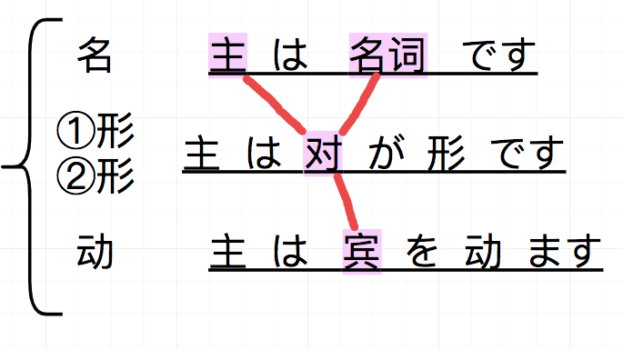

# 生肉体验笔记.
* 名字 +  んち === 名字 + さんのうち
    >表示谁的家

* 仲良くいい　 关系好.
* 仲良くなる    变得关系好.

* 辨析:
    > おかしい　　　①类动词 
    > おかしな　　　②类动词

* おしゃれ　　　 时尚,时髦

* 残る (のこる)   剩下
    >残っている  剩下了.

* あげよう　=== あけましょう

* 誰に迷惑(めいわく)をかける　　
    >给谁添麻烦

* 気が利く (きがきく)  脑袋机灵

* 小屋 (こや)
    >小屋，小房间

* 辨析
    >女優さん(じょゆうさん)　　　 女演员. 
    >俳優(はいゆう)　　　 　　　 男演员(不是用男優)

* 二十代(にじゅうだい)  二十多岁.

* ~につく
    >到达~地方.

* ~ を披露する(ひろうする)　　　 表演~

* 人生ゲーム　　　 大富翁

* 貧乏人　(びんぼうにん)　　穷人

* 負ける(まける)　 输掉

* お手洗い 　　　 洗手间

# 第二十五课.
* 重点: 名词修饰形 (一堆东西，修饰名词)

## 单词.
* 専門(せんもん)　　专门. 专业
    > 日本語専門 　　　 日语专业. 
    > ~用語(ようご)　　　 专业用语，专业术语

* 成田空港(なりたくうこう)　　　 成田机场.
    > 梗: 度蜜月回来就离婚.

* 说 ** 演员， 不用加　さん， 因为，我们只是知道这个人，而不是认识.

* 自然(しぜん)　　　 大自然，
    > 自然に　　　 自然地做~

* 【料】 在日语中一般表示成费用,  無料，有料、給料(きゅうりょう) [工资]

* 月给　　　 月薪，  年给　　　 年薪.

* 怪我(けが)　　　 伤(v)
    >けがをする　　　受伤.

* 結ぶ(むすぶ)　　　连接，系.

* 取る　　　印，记下.
    >メモを取る　　记笔记.　

* 生まれる　　　　诞生,出生.
    >私は三月に生まれました。　　　我是三月出生的. 
    >女の子が生まれました。　　　生了个女孩.

* 倒産(とうさん)　　破产，倒闭.

* 渋滞(じゅうたい)　　堵车，停滞.
    >この辺(あた)りはよく渋滞する　。 这一带经常堵车.

* 豊か　(ゆたか)　　充裕，丰富(二类adj)
    >緑豊かな森。　植被茂盛的森林.

* 別に(べつに) 　　并不，
    >これがほしい？　別に，欲しくない 
    >想要这个吗？并不，不想要.

* だいぶ　　　　非常，（落差毕竟大的那种)

* 辨析
    >このあたり　　这一带 
    >そのあたり　　那一带 

* 辨析
    > 泊まる(とまる)　　　　短住, 
    >住む(すむ)　　　　　　长住 
    > 它们的助词，都是用に、 
    > 友達のうちに泊まる.    
    > 友達のうちに住む　.    

* 辨析.
    >大きい ＋ 名词. 
    >小さい + 名词. 
    >这两个都是形容词， 形容的内容，一般是具体的，具象的. 
    > 并且可以做谓语，如下 
    >Penは小さいです。

    >大きな + 名词 
    >小さな + 名词 
    >这两个，成为连体词，形容的内容，一般是抽象的，. 
    >使用方法是，后面必须接名词，不能像上面的形容词一样做谓语. 
    >小さな野望。

* 结构知识.
    > 三类动词, 一般是　　汉字 | 外来语  + する 
    > 【汉字 | 外来语】  这部分可以当做名词来使用. 
    >勉強する  
    >勉強をする.  这两种说法都可以.

## 语法，（名词修饰形)
* 回顾名词的接法
    >动 and 名　　　　=>　原型　|　た + 名词. 
    >①adj　and 名　　=>　①adj + 名， eg:　可愛い猫 
    >②adj　and 名　　=>　②adj な 名，eg:　綺麗な猫 
    >名 and 名　　　　=>　名の名，　　eg: 日本語の本. 

    > 【一堆修饰词】 + 猫，　　　该怎么写？ 
    > 【一堆修饰词】的简体形　+　猫。 
    >eg: これは資料です，明日会議で使います。 
    >　　これは【明日会議で使う】資料です. 
    > 
    >eg: 飛行機は中国航空です，私が明日乗ります。 
    >　【私が明日乗る】飛行機は中国航空です。 
    > 
    >これは葉子先生が日本の友達にもらった目薬です.

* 今日とまるホテルは天安饭店でしだね。
    >这里的行为，是表示将要进行的动作，但是，却用了　でした. 
    >这里的でした表示确认. 确认这个事件.

* 常用.
    >たしか〜でしたね。 
    >たしか〜だったね 

* 【あそこにある】　【大きな】　【白い】　建物はなんですか.
    >这种，一堆修饰的， 长的放前面， 短的放后面.

# 第二十六课

* 風が強い　　(かぜがつよい)　风很大

* 握手(あくしゅ)　n. 握手
    > 握手する　v.握手

* お辞儀(おじぎ)　n.鞠躬
    >お辞儀　　v.鞠躬

* 普通(ふつう)　n.普通，普遍
    > 普通の人生　　普通的人生

* 仲(なか)　n.关系，友谊
    >仲がいい　　关系好, 
    >仲が悪い　　关系不好 
    >仲直り　　　重归于好 
    >仲間(なかま) 伙伴

* 忘れ物(わすれもの)　　忘记的东西
    >在提醒时会说.　　忘れ物ですよ！ 
    >忘れ物しないで。　　不要忘记东西.

* 回る(まわる)　走访,转弯.

* 走る(はしる)　　跑，奔跑,  
    >这个词是是 ①类adj.　　走って

* 吹く(ふく)　　v. 吹
    >明日は明日の風が吹く. 
    >船到桥头自然直.

* 挙げる(あげる)　　v.举起

* 足りる(たりる)　　足，足够. 
    >足りない　　不够

* 優勝する(ゆうしょうする)　　得冠军。
    > 優勝者　　n. 冠军

* 合格する(ごうかくする)　　及格，合格.
    >~に合格する　　　~考试合格. 
    >日本語能力試験に合格する. 
    >日语能力考试及格. | 通过日语能力考试.

* 約束する(やくそくする)　　约定.
    >約束だよ！   约定了哈！

* もしかしたら　　(副)　　也许.

* すぐに　　　就要，马上，立刻.
    >すぐに顔に出る。　　立马表现在了脸上. 
    >すぐに分かる。　　　马上就知道了.

* ほとんど　　大部分.

* それで　　　因此.

* 挨拶回り(あいさつまわり)　　　寒暄拜访.

* いけない　　不好,不可以.
    >这个就是　　〜てはいけません。的简体. 
    >这个女生用得多，男的用的少.

* 辨析:　それで和だから都是表现因此. 
    >だから　　语气强烈.　　~.だから,〜てください. （可以加祈使语气) 
    >それで　　语气谦逊.　　~.それで,〜 (陈述句)

 
 

## 语法.

* 如果我要用一个句子来放在这里【粉色的部分】. 那么我就要用.
    >【句子简体】 + の　　=>　　が好き. 
    >形式体言. 
    >体言: 不会随时态变化的词.(数，量，代，名) 
    >用言: 形，动 
    >eg: コーラを飲む　の　が好き. 
    >我喜欢喝可乐.

* の和こと 辨析.(from P15)
    > の句子， 作为主语时， 一般不能和こと换. 
    > の句子, 做宾语时，可以和 こと互换. 
        > 如果谓语动词是 “知らせる，伝えます、話す”等表示语言行为的动词时， 要用こと而不能用の. 
        > 如果谓语动词是 "見る、聞く、"等表示感知的动词或者，“手伝います、やめます、防ぎます”等表示直接作用于动作对象的动词时，要用の.

## 句型

* 多分 {　名　|　①形　|　②形　|　动　}　　でしょう . 　
    >大概〜吧 | 可能〜吧. (有把握的推断)  
    >あの人は多分日本人でしょう. 
    >多分くるでしょう. 
    > でしょう　 => (简体)　　だろ.

* もしかしたら, 〜かもしれません.　　也许 (30%)
    >かもしれません　　　=>　　(简体)　かもしれない.　　 
    >(かも)   行きたくないかも.　=>　　我有点不怎么想去样.　(把自己的想法变得委婉.)

* つい握手(あくしゅ)するのを忘れます.
    > 本来我不想忘记握手的，结果忘了. (事与愿违) 
    >つい ： 不小心做了某事，而本意不是这样的.

* 翻译作业：
    >1. 那边那个穿蓝T恤的帅帅的男孩子不是我的男朋友。 
    > あそこの青いTシャツを着ているハンサムな男の子は私の彼氏じゃない 
    >2. 你知道叶子老师胖了3公斤吗？ 
    > 葉子先生が３キロ太ったのを知っていますか。 
    > 太る(ふとる) 表示 变胖.  
    > 如果要说一个人很胖： 太っている

# 第二十七课

## 单词:

* 大勢(おおぜい)　　很多,
    >人が大勢いる 

* 教師　　　教师 
    >教師　　　是一种职业; 
    >先生　　　是一种尊称

* お年寄り　　　老年人. 
    >老人(ろうじん)ホーム　　养老院

* 卓球(たっきゅう)　　乒乓球.

* 賞(しょう)　　　奖(n).

* 曲(きょく)　　乐曲，歌曲.
    > いい曲だね　　旋律好，曲调好.

* 信号(しんごう)　　信号.红绿灯
    > 赤信号　　红灯. 
    > 青信号　　绿灯. 
    > 黄信号(き信号)　　黄灯.

* 鋏(はさみ)　　剪刀.
    >はさみで紙を切る　　用剪刀剪纸

* アルバイト　　　打工. 一般说 バイト。

* スピード　　演讲.(speach)

* グラフ　　图表(graph)

* 企画(きかく)　　策划，企划.(n)

* 説明(せつめい)　　说明.

* 砂糖(さとう)　　砂糖(n).

## 动词

* 通う(かよう)　　上学，往返.(一般，往返于某地，暗指一直在学什么，做什么)
    > ~に通っています。　往返于某地(暗指在学什么) 
    >ジムに通っています。 往返于健身房.(最近在健身)

* 集まる(あつまる)　　聚集，集合(自)。

* 集める(あつめる)　　收集(他)
    >〜を集める　　　收集~

* 踊る(おどる)　　跳舞.

* 辨析:
    > 居る　(いる)　②类　　います、いない
    > 要る　(いる)　①类　　いります、いらない

* 困る(こまる)　　为难，难办

* 叩く(たたく)　　拍，敲，打

* 入れる(いれる)　　放入，放进
    > AにBを入れる　　把B放入A中.

* 看病する(かんびょうする)  护理.(v)

* 喧嘩する(けんかする)　　吵架，打架

* 利用する(りようする)　　利用.

* 相談する(そうだんする)　　商谈.
    > 相談に乗る　　倾听我内心的想法. 
    > 相談に乗ってください。请倾听我内心的想法

## 其他

* ほかに　　另外.
    > ほかに好きな人ができだ.　　我有其他喜欢的人了.

* しばらく　片刻，许久.
    > しばらくお待ちください。稍等片刻.

* しばらくです　　好久不见.

*  辨析
    > この前(このまえ)　　之前. 
    > この間(このあいだ)　　前几天.

* 辨析
    > そう言えば　　说起来,(前后逻辑有联系) 
    > ところで　　　话说回来(前后无关系)

*  東京(とうきょう)　行きのバース。　　去东京的公交车.

## 句型 and 语法
* 日本で大きな地震(じしん)が【あります】。
    > 【あります】表示发生，修饰地点，用 〜で。

* ~時  用法
    > 子供(こども)の時, 大きな地震がありました。 
    > 日本に行く時,〜〜〜〜〜〜〜 
    > 日本に行った時,〜〜〜〜〜 
    > 忙しい時,〜〜〜〜〜 
    > 暇な時,〜〜〜〜〜 
    > 【絵画を見る】時,〜〜〜〜〜。这里，括号里面是经常发生的动作。 

* ながら族　　　~一族（作什么，都要一边做A一边做B的人)
    > 〜(V去ます) + ながら + 〜.  一边做~，一边做. 
    > シャワーを浴びながらドラマを見ています。 一边洗澡，一边看剧.

* 学生の時,何を勉強しましたか。　一般是问你，大学学的什么专业，而不是字面上的意思.

* 〜について　　　关于〜

* 仕事(しごと)で,陽さんとあっていたんです。
    > 这里的【仕事で】表示，因为工作， n で、表示因为. 

* 辨析
    > 〜に会う， 单方面的， 我去会见 
    > 〜と会う,  双方面的， 双方碰面.

* 辨析
    > 昨日の夜,日本語の授業(じゅぎょう)を【受けました】。 我做过这件事。
    > 昨日の夜,日本語の授業(じゅぎょう)を【受けていました】。 强调，我在这段时间内，一直都在做这件事. 
    > 反复，持续性　　　　〜ている。

* 大学の時ダンス教室に通っていました。
    > 大学时，在练舞室学过舞。(强调有一段时间，一直在学舞.)

* 同意:
    > 小さい時　　
    > 子供の時　　这两个都是 【小时候】。

* 私は遊びながら祖母(そぼ)が太極拳(たいきょくけん)をするのをみていました。
    > 我是一边玩，一边看祖母打太极拳.

# 第二十八课
## 单词
* マフラー　　　　围巾(muffler)
* ネックレス　　　项链(necklace)
* 家具(かぐ)　　　家具
* 文章(ぶんしょう)　文章
* 文(ぶん)　　文章，句子.
* 意味(いみ)　　意思,[n]
    >どういう意味?　　什么意思 
    >意味わからない。  不明白
* 雰囲気(ふんいき)　　气氛,气场.
* 不動産屋（ふどうさんや）　房产公司,房产公司的人
* 飲食店（いんしょくてん）　　饮食店，餐馆.
* 大使館（ たいしかん）　大使馆
* 引っ越し（ひっこし）　搬家[n]
    >引っ越しする　　搬家[v]
* 近所（きんじょ）［n］附近，一般指家附近
    >近所トラブル　　　邻里关系差.
* 係(かかり)　　工作人员，主管人员
    >生き物がかり　　生物股长.
* 支社長(ししゃちょう)　　分公司.
    >本社(ほんしゃ)　　本部.
* 就職(しゅうしょく)　就职，就业.
* インターネット　　互联网[n] internet
    >简称　ネット
## 动词
* 拾う(ひろう)　捡东西，拾取,
    >財布を拾う　　捡到了钱包. 
    >タクシーを拾う　　打出租车.
* 訳す(やくす)　　翻译.
    >以下(いか)の中国語を日本語に訳してください. 
    >请把下列汉语翻译成日语.
* くれる　　给(v　究极语法动词)
* 届ける(とどける)　　送到，送去. (他)
    >渡す　　，一般表示，A转交给B(没什么距离) 
    >届ける ，送到, 表示， A要经过一段很长的距离，才能送到B手里.
    >届く(自)　　手紙を届く
* 案内する(あんないする)　　向导，导游(v)
* 交換する(こうかんする)　　换，交换(v)
* 紹介する(しょうかいする)　　介绍(v)
    >自己紹介(じこ~)　　自我介绍
-----------
* 素敵 (すてき)　　漂流，极好， nice. (一般女生用)
* 新鮮(しんせん)　　新鲜
* うまく　　很好地，顺利地,高明地
    >うまくできました。 完成的很好哦.
* それに　　而且
* どの辺(どのへん)　　哪儿，哪边.
* ~先(さき)　　~的地方.
    >行き先　　　目的地，要去的地方.
## 语法.(主要讲授受关系)
* 基本授受关系:
    >AはBに花をあげる。 A把花给B. 
    >BはAに花をもらう。B收到来自A的花. 
    >Bは私に花をくれる。B给了我花. 
* 同样类比，把动词变成て形，完全如此，一样适用.
    >〜てあげる 
    >〜てもらう 
    >〜てくれる 
* demo1
    >私があなたに【荷物を持って】あげる。我给你【拿东西】. 
    >私は先輩に【荷物を持って】もらう。　　我收到前辈【给我拿行李这个】恩惠. 
    >先輩が私に【荷物を持って】くれる。　　前辈给我拿行李. 
    >一般在描述时，都是用　　私は、私が 
    >而在表示感谢时，一般是用 
    >〜てくれてありがどう。感谢〜 
* demo2
    >明日学生にレポートを書いてもらう。(表命令，安排) 
    >我明天要让学生写一份报告.
* demo3
    >在使用　　私に〜てくれる。中. 
    >【私に】不是绝对的，有时候会是和我一方的人. 
    >比如感谢别人辅导我的妹妹时,此时，我妹妹就是和我一方的，对于外人来说. 
    >妹に宿題をやってくれてありがとう. 
    >谢谢(你)给我妹妹做作业.
* demo4
    >在使用这个【〜てあげる】句型时，有种，我施恩与你的感觉. 
    >适合对平辈，同级，下级使用 
    >近所をあんないしてあげる。 
    >而，对上级该这么用. 
    >近所を案内しましょうか。 

##  宿題
* 妈妈走进房间的时候，看见熊猫君正在做广播体操.
    >お母さんは部屋に入った時パンダ君が体操をしているのを見た。
* 我把叶子酱送给我的围巾弄丢了.
    >私は葉子ちゃんくれたマフラーをなくした。

# 第二十九课
## 单词
* 質問（しつもん）　　提问，问题.
    >質問に答える。　　回答问题.
* 場合（ばあい）　　场合，情况.
    >雨の場合　　下雨的情况. 
    >こんなことをしている場合じゃない. 
    >现在不是(这个场景)做这个的时候！ 
* 迷惑(めいわく)　　麻烦.
    >〜に迷惑をかける　　给〜添麻烦.
* マーク　　符号,标记(mark)
    >マークをつける　　标记，画记号 
* 横断禁止(おうだんきんし)　　禁止横穿马路.
* スピード　速度[n]
    >スピードを上げる　　加速 
    >スピードを落とす　　减速 
    >男を落とす　　攻略男生.
* 免許証(めんきょしょう)　　许可证，执照
    >一般理解为【驾照】 
    >免許証を持っている　　拥有驾照. 
    >paper driver　　本本一族.(只有本本，没开过车)
* テーブル　　桌子.
    >テーブル　　吃饭的桌子 
    >つくえ　　　工作，学习的书桌
* 戦争(せんそう)　　战争.
* 年上(としうえ)　　　年长者.
    >年下(としした)　　年幼者.
## 动词
* 止まる　　停，停住，(自，自己停住)
* 変わる　　变化，变
* 頑張る　　拼命努力
    >がんばります　　加油！(给自己加油) 
    >这里的　ます　形，表示自己的一种意志.
* 謝る(あやまる)　　道歉
* サボる　　逃学，怠工.
    >学校｜授業｜仕事　をサボる　　
* 破る(やぶる)　　爽约,打破.
    >約束を破る　　不遵守约定
* 引く(ひく)　　拉，抽
    >手を引く　　指从某件事中退出(抽手出来) 
    >足を洗う　　金盆洗手(不干了)
* 守る(まもる)　　遵守，保护.
    >約束を守る　　遵守约定 
    >香菜ちゃんの笑顔(えがお)は私が守る。 
* 答える(こたえる)　　回答，
    >質問に答える　　回答问题
* 逃げる(にげる)　逃跑.
* 助ける(たすける)　　救助，帮助
* 付ける(つける)　　添加，附加,把一种东西贴在另一个上.
* 覚える(おぼえる)　　记住，掌握,
    >漢字を覚える　　 
    >単語を覚える
* 提出する（ていしゅつする）　　提交，提出
    >宿題を提出する　　提交作业.
* 遠慮する（えんりょする）　　客气.
    >遠慮しないで　　别客气. 
    >どうぞ，ご遠慮なく　　请把，不用客气. 
    >遠慮させていただきます　　请允许我拒绝.
* シュートする　　射门，投篮(shoot)
    >一般进球时，会说　　決まった！
* 注意する (ちゅういする)　　注意,提醒，警告
    >先生に注意されました　　被老师注意[警告]了. 
    >〜を注意する　　　提醒〜
* 親しい(したしい)　　熟悉，亲切，亲密.
* 乱暴　(らんぼう)　　粗暴
    >乱暴な男　　粗暴的男子. 
    >乱暴な運転　　粗暴的开车(方式) 
* 失礼(しつれい)　　不礼貌，失礼
* 同じ(おなじ)　　一样，相同.
    >注意： 这是一个二类动词.但是，形容的时候，不加な 
    >同じ世界,同じ夢!　　同一个世界，同一个梦想！ 
    >同じ年　　同岁. 
    >私たちは同じ年だね！　　我们是同岁诶！
* 危険(きけん)　　危险(书面)
* そんな　　　　那样的. [连词]
* 離す(はなす)　　放开，离开
* 丁寧に(ていねいに)　　恭敬地, 细心地
    >先生が丁寧に日本語を教える　　老师细心地教日语.
* 誠(まこと)　　诚，阿诚.
    >誠に申し訳ございません！　　真诚地道歉！
* 辨析:
    >変わった　　 
    >変わってる　 
    >这两个词，都表示 怪，与众不同,比起【変な人】程度要轻一些.
 
## 语法 (动词的命令形)
* ①类动词　　u段变e段，  書く　　=>　　書け
* ②类动词　　把る变成ろ，　　食べる　　=>　　食べろ
* ③类动词
    >くる　　=>　　こい 
    >する　　=>　　しろ

> リア充爆発しろ(りあじゅう　ばくはつしろ) 
> 现充爆炸！

> 勉強しろ !(标准的命令形，强硬的命令形，男角色用的多) 
>早く起きなさい！(这个也是命令形，较柔和，女角色用的多) 

* 动词原形 +  な　　　表示，不要~, 禁止~
    >俺に惚れるな　　! 　　不要爱上我！

* Aは「B」という意味 　　A就是B的意思.
    >一般用在给事物下定义的时候使用. 
    >これは何と読みますか。　　这个怎么读.

* AというB　　　叫做A的B.
    >山田という男。　　叫做山田的男的. 
    >パンダという動物。　　叫做熊猫的动物.

* 辨析:
    >言うわないと [いけません]  不得不说~ 
    >言うわなければなりません， 不得不说~ 
    >言うわなぎゃ｜言うわなくちゃ. 不得不说 ~ (口语化) 
    > 注意： 这里的 ~わないと是 不得不~，

* んです　　　也表示，解释，说明.

* 〜方をする　　　用~方式进行某个动作.
    >そんな乱暴(らんぼう)な言う方をしないでください. 
    >别用那么粗暴的说话方式.

* 辨析:
    >〜てください.　请〜(相对礼貌的用法) 
    >〜て.　请〜(不那么礼貌) 
    >〜ないでください.　请不要〜(相对礼貌的用法) 
    >〜ないで.　请不要〜(不那么礼貌) 

